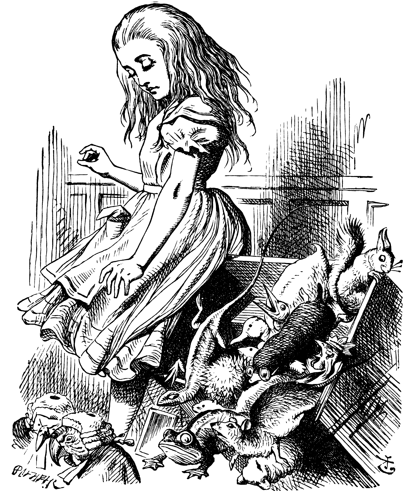
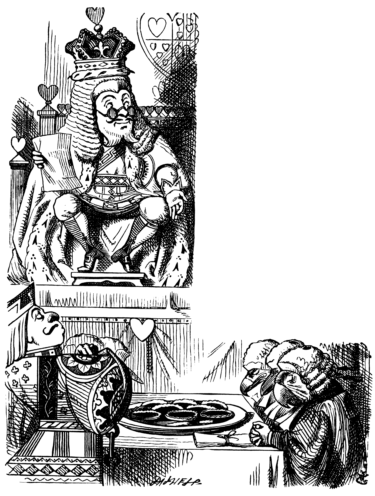
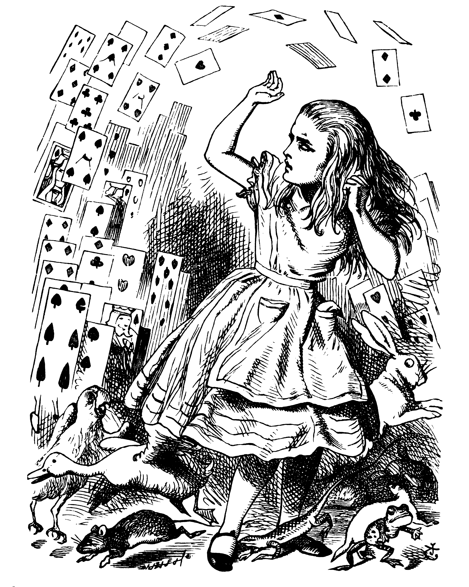

### XII. Alice’s Evidence

<Xfigure :src="pix40"
caption="Alice is in the process of standing up, and in doing so, upsetting a jury-box filled with small animals." />

“Here!” cried Alice, quite forgetting in the flurry of the moment how large she had grown in the last few minutes, and she jumped up in such a hurry that she tipped over the jury-box with the edge of her skirt, upsetting all the jurymen on to the heads of the crowd below, and there they lay sprawling about, reminding her very much of a globe of goldfish she had accidentally upset the week before.

“Oh, I _beg_ your pardon!” she exclaimed in a tone of great dismay, and began picking them up again as quickly as she could, for the accident of the goldfish kept running in her head, and she had a vague sort of idea that they must be collected at once and put back into the jury-box, or they would die.

“The trial cannot proceed,” said the King in a very grave voice, “until all the jurymen are back in their proper places ⁠— _all_,” he repeated with great emphasis, looking hard at Alice as he said so.

Alice looked at the jury-box, and saw that, in her haste, she had put the Lizard in head downwards, and the poor little thing was waving its tail about in a melancholy way, being quite unable to move. She soon got it out again, and put it right; “not that it signifies much,” she said to herself; “I should think it would be _quite_ as much use in the trial one way up as the other.”

As soon as the jury had a little recovered from the shock of being upset, and their slates and pencils had been found and handed back to them, they set to work very diligently to write out a history of the accident, all except the Lizard, who seemed too much overcome to do anything but sit with its mouth open, gazing up into the roof of the court.

“What do you know about this business?” the King said to Alice.

“Nothing,” said Alice.

“Nothing _whatever_?” persisted the King.

“Nothing _whatever_,” said Alice.

“That’s very important,” the King said, turning to the jury. They were just beginning to write this down on their slates, when the White Rabbit interrupted: “_Un_ important, your Majesty means, of course,” he said in a very respectful tone, but frowning and making faces at him as he spoke.

“_Un_ important, of course, I meant,” the King hastily said, and went on to himself in an undertone, “important ⁠— unimportant ⁠— unimportant⁠ — important ⁠—” as if he were trying which word sounded best.

Some of the jury wrote it down “important,” and some “unimportant.” Alice could see this, as she was near enough to look over their slates; “but it doesn’t matter a bit,” she thought to herself.

At this moment the King, who had been for some time busily writing in his notebook, cackled out “Silence!” and read out from his book, “Rule Forty-two. _All persons more than a mile high to leave the court._”

Everybody looked at Alice.

“_I’m_ not a mile high,” said Alice.

“You are,” said the King.

“Nearly two miles high,” added the Queen.

“Well, I shan’t go, at any rate,” said Alice: “besides, that’s not a regular rule: you invented it just now.”

“It’s the oldest rule in the book,” said the King.

“Then it ought to be Number One,” said Alice.

The King turned pale, and shut his notebook hastily. “Consider your verdict,” he said to the jury, in a low, trembling voice.

“There’s more evidence to come yet, please your Majesty,” said the White Rabbit, jumping up in a great hurry; “this paper has just been picked up.”

“What’s in it?” said the Queen.

“I haven’t opened it yet,” said the White Rabbit, “but it seems to be a letter, written by the prisoner to ⁠— to somebody.”

“It must have been that,” said the King, “unless it was written to nobody, which isn’t usual, you know.”

“Who is it directed to?” said one of the jurymen.

“It isn’t directed at all,” said the White Rabbit; “in fact, there’s nothing written on the _outside_.” He unfolded the paper as he spoke, and added “It isn’t a letter, after all: it’s a set of verses.”

“Are they in the prisoner’s handwriting?” asked another of the jurymen.

“No, they’re not,” said the White Rabbit, “and that’s the queerest thing about it.” (The jury all looked puzzled.)

“He must have imitated somebody else’s hand,” said the King. (The jury all brightened up again.)

“Please your Majesty,” said the Knave, “I didn’t write it, and they can’t prove I did: there’s no name signed at the end.”

“If you didn’t sign it,” said the King, “that only makes the matter worse. You _must_ have meant some mischief, or else you’d have signed your name like an honest man.”

There was a general clapping of hands at this: it was the first really clever thing the King had said that day.

“That _proves_ his guilt,” said the Queen.

“It proves nothing of the sort!” said Alice. “Why, you don’t even know what they’re about!”

“Read them,” said the King.

The White Rabbit put on his spectacles. “Where shall I begin, please your Majesty?” he asked.

“Begin at the beginning,” the King said gravely, “and go on till you come to the end: then stop.”

These were the verses the White Rabbit read: ⁠—

> “They told me you had been to her,\
> &emsp;And mentioned me to him:  \
> She gave me a good character,\
> &emsp;But said I could not swim.
>
> He sent them word I had not gone  \
> &emsp;(We know it to be true):  \
> If she should push the matter on, \
> &emsp;What would become of you?
>
> I gave her one, they gave him two,  \
> &emsp;You gave us three or more;  \
> They all returned from him to you,  \
> &emsp;Though they were mine before.
>
> If I or she should chance to be \
> &emsp;Involved in this affair, \
> He trusts to you to set them free, \
> &emsp;Exactly as we were.
>
> My notion was that you had been \
> &emsp;(Before she had this fit) \
> An obstacle that came between \
> &emsp;Him, and ourselves, and it.
>
> Don’t let him know she liked them best, \
> &emsp;For this must ever be \
> A secret, kept from all the rest, \
> &emsp;Between yourself and me.”

“That’s the most important piece of evidence we’ve heard yet,” said the King, rubbing his hands; “so now let the jury⁠ —”

“If any one of them can explain it,” said Alice, (she had grown so large in the last few minutes that she wasn’t a bit afraid of interrupting him,) “I’ll give him sixpence. _I_ don’t believe there’s an atom of meaning in it.”

The jury all wrote down on their slates, “_She_ doesn’t believe there’s an atom of meaning in it,” but none of them attempted to explain the paper.

“If there’s no meaning in it,” said the King, “that saves a world of trouble, you know, as we needn’t try to find any. And yet I don’t know,” he went on, spreading out the verses on his knee, and looking at them with one eye; “I seem to see some meaning in them, after all. ‘_— said I could not swim⁠ —_’ you can’t swim, can you?” he added, turning to the Knave.

The Knave shook his head sadly. “Do I look like it?” he said. (Which he certainly did _not_, being made entirely of cardboard.)

“All right, so far,” said the King, and he went on muttering over the verses to himself: “ ‘_We know it to be true⁠—_’ that’s the jury, of course⁠—‘I gave her one, they gave him two⁠—’ why, that must be what he did with the tarts, you know⁠ —”

“But, it goes on ‘_they all returned from him to you_,’ ” said Alice.

<Xfigure :src="pix41"
caption="The King of Hearts is seated on a throne, wearing spectacles. Below him stands the Knave of Hearts and on a table is a plate of tarts."
/>

“Why, there they are!” said the King triumphantly, pointing to the tarts on the table. “Nothing can be clearer than _that_. Then again ⁠— ‘before she had this fit ⁠—’ you never had fits, my dear, I think?” he said to the Queen.

“Never!” said the Queen furiously, throwing an inkstand at the Lizard as she spoke. (The unfortunate little Bill had left off writing on his slate with one finger, as he found it made no mark; but he now hastily began again, using the ink, that was trickling down his face, as long as it lasted.)

“Then the words don’t _fit_ you,” said the King, looking round the court with a smile. There was a dead silence.

“It’s a pun!” the King added in an offended tone, and everybody laughed, “Let the jury consider their verdict,” the King said, for about the twentieth time that day.

“No, no!” said the Queen. “Sentence first⁠ — verdict afterwards.”

“Stuff and nonsense!” said Alice loudly. “The idea of having the sentence first!”

“Hold your tongue!” said the Queen, turning purple.

“I won’t!” said Alice.

“Off with her head!” the Queen shouted at the top of her voice. Nobody moved.

“Who cares for you?” said Alice, (she had grown to her full size by this time.) “You’re nothing but a pack of cards!”

<Xfigure :src="pix42"
caption="Alice is standing, trying to fend off a cloud of playing-cards which swirl up around her. At her feet are many small animals." />

At this the whole pack rose up into the air, and came flying down upon her: she gave a little scream, half of fright and half of anger, and tried to beat them off, and found herself lying on the bank, with her head in the lap of her sister, who was gently brushing away some dead leaves that had fluttered down from the trees upon her face.

---

“Wake up, Alice dear!” said her sister; “Why, what a long sleep you’ve had!”

“Oh, I’ve had such a curious dream!” said Alice, and she told her sister, as well as she could remember them, all these strange Adventures of hers that you have just been reading about; and when she had finished, her sister kissed her, and said, “It _was_ a curious dream, dear, certainly: but now run in to your tea; it’s getting late.” So Alice got up and ran off, thinking while she ran, as well she might, what a wonderful dream it had been.

But her sister sat still just as she left her, leaning her head on her hand, watching the setting sun, and thinking of little Alice and all her wonderful Adventures, till she too began dreaming after a fashion, and this was her dream: ⁠—

First, she dreamed of little Alice herself, and once again the tiny hands were clasped upon her knee, and the bright eager eyes were looking up into hers⁠—she could hear the very tones of her voice, and see that queer little toss of her head to keep back the wandering hair that _would_ always get into her eyes⁠—and still as she listened, or seemed to listen, the whole place around her became alive with the strange creatures of her little sister’s dream.

The long grass rustled at her feet as the White Rabbit hurried by⁠—the frightened Mouse splashed his way through the neighbouring pool ⁠— she could hear the rattle of the teacups as the March Hare and his friends shared their never-ending meal, and the shrill voice of the Queen ordering off her unfortunate guests to execution⁠ — once more the pig-baby was sneezing on the Duchess’s knee, while plates and dishes crashed around it⁠ — once more the shriek of the Gryphon, the squeaking of the Lizard’s slate-pencil, and the choking of the suppressed guinea-pigs, filled the air, mixed up with the distant sobs of the miserable Mock Turtle.

So she sat on, with closed eyes, and half believed herself in Wonderland, though she knew she had but to open them again, and all would change to dull reality ⁠— the grass would be only rustling in the wind, and the pool rippling to the waving of the reeds ⁠— the rattling teacups would change to tinkling sheep-bells, and the Queen’s shrill cries to the voice of the shepherd boy ⁠— and the sneeze of the baby, the shriek of the Gryphon, and all the other queer noises, would change (she knew) to the confused clamour of the busy farmyard ⁠— while the lowing of the cattle in the distance would take the place of the Mock Turtle’s heavy sobs.

Lastly, she pictured to herself how this same little sister of hers would, in the aftertime, be herself a grown woman; and how she would keep, through all her riper years, the simple and loving heart of her childhood: and how she would gather about her other little children, and make _their_ eyes bright and eager with many a strange tale, perhaps even with the dream of Wonderland of long ago: and how she would feel with all their simple sorrows, and find a pleasure in all their simple joys, remembering her own child-life, and the happy summer days.
